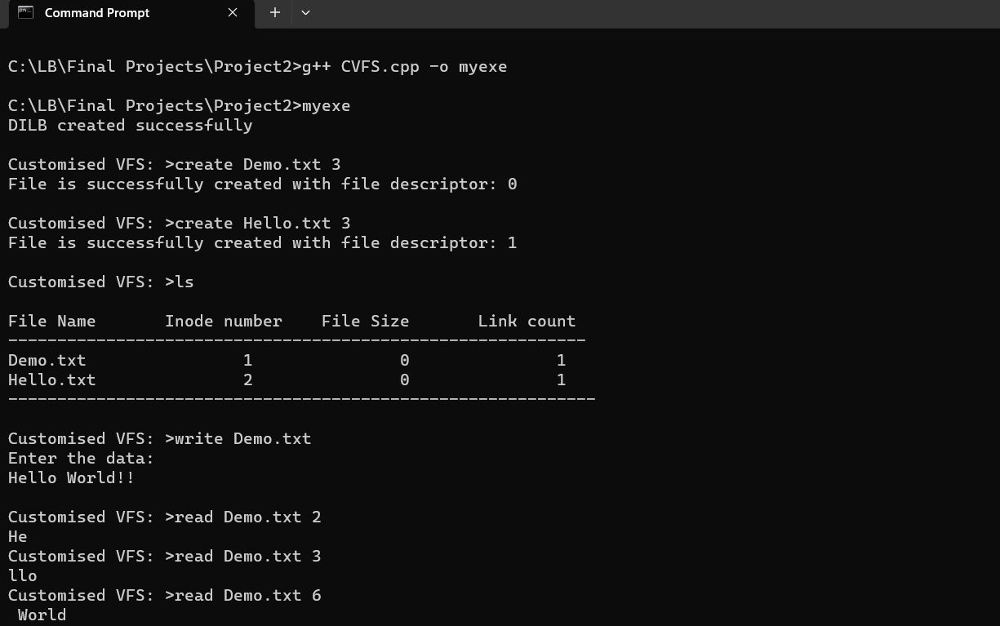
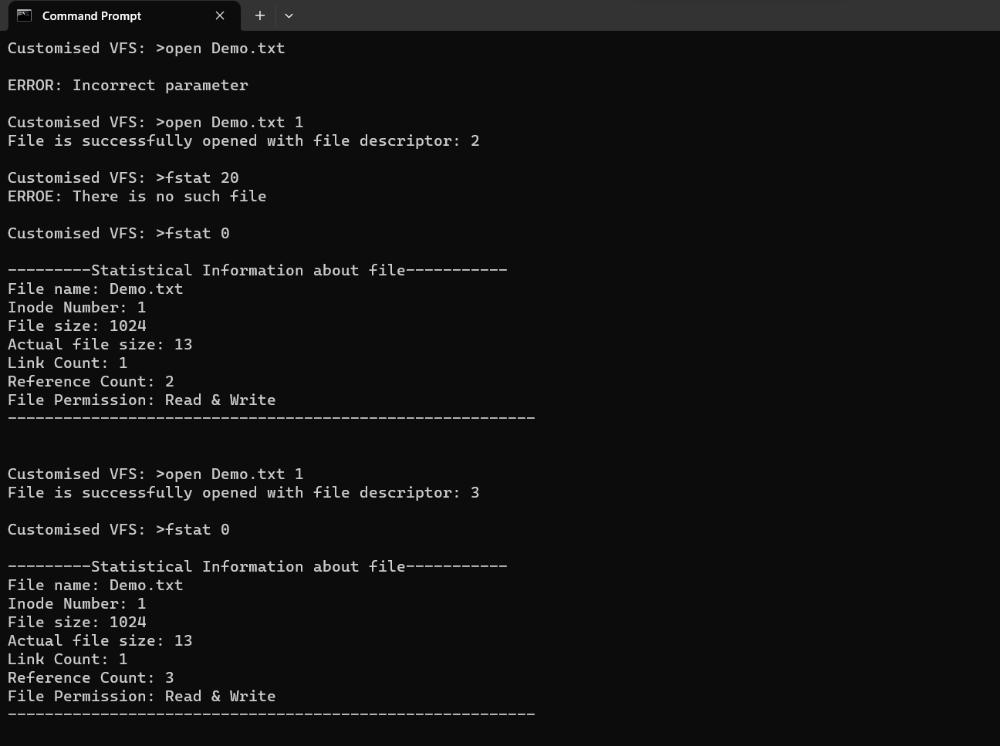
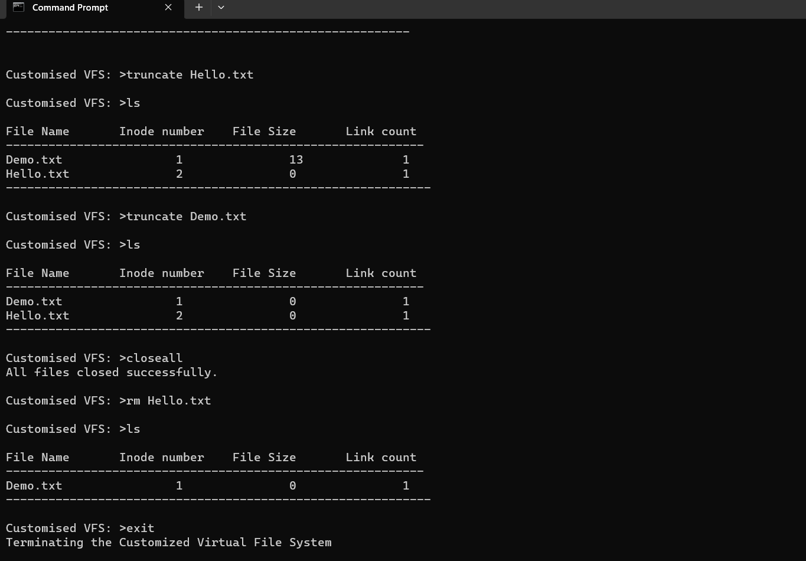

<div align="center">
    <h1>CUSTOMIZED VIRTUAL FILE SYSTEM</h1>
    <!--<i>A collective list of free APIs for use in software and web development</i>-->
</div>


<!--censed Under The  [MIT License](https://github.com/PRASAD-DANGARE/Virtual_File_System/blob/main/LICENSE)
[](https://github.com/PRASAD-DANGARE/Virtual_File_System/blob/main/LICENSE)
[](https://github.com/PRASAD-DANGARE/Virtual_File_System/blob/main/Virtual_File_System.cpp)-->


#

### PLATFORM REQUIRED :   
```
Windows Platform Or Linux Distributions.
```
### ARCHITECTURAL REQUIREMENT :  
```
INTEL 32 Bit Processor Or Higher.
```
### USER INTERFACE :             
```
Command Line Interface.
```
### TECHNOLOGY USED : 
```
System Programming Using C.
```
#


<div align="center">
    <h1>ABOUT CUSTOMIZED VIRTUAL FILE SYSTEM</h1>
</div>


#

```
1) In this project I emulate all data structures which are used by operating system to manage file system oriented asks.

2) As the name suggests its virtual because I maintain all the records in primary storage (RAM).

3) In this project I create all data structures which required for file subsystems as : FT, UAREA, UFDT, SB, DILB, DB etc.

4) I provide all implementations of necessary system calls and commands of file subsystem as : Open, Close, Read, Write, Lseek, Create, RM, LS, Stat, Fstat etc.

5) While creating this project all above functionality I use our own data dtructures by referring algorithms of UNIX Operating System.

6) By using this project I can get overview of UFS (UNIX File System) on any platform.
```

#


<div align="center">
    <h1>DEMO OUTPUT</h1>
</div>


#



#



#


